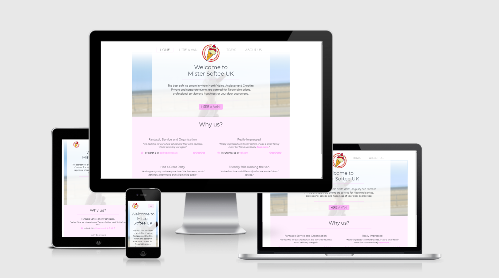

# [Mr Softee](https://sscip.github.io/mr-softee-ms1/)

## Idea/Description
---
Idea behind this project is to create a mobile first pseudo website for existing Ice Cream Van business I work for over the weekends. Since I am in the business for over 2 years, I have a good insight and ideas how the website should look. I want to make it light, easy to browse and understand, with only most useful information about company and what services it provides. You can find it [**here**](https://sscip.github.io/mr-softee-ms1/) and Github repository [**here**](https://github.com/sscip/mr-softee-ms1).

>**Important:** I have agreed with business owner to use any text or images (not code) off his current website for this project for learning purposes, their usage will be credited here or in the comments by their code.

<br />



<br />

## Potential Website Users
---
This website is created for regular people as well as event organisers with plenty of information what company does and what services provide, i.e. van hire for private and corporate events and off season desserts.

<br />

## Owners goals
---
This website would be owned by the owner of the comany and used for informative purposes for potential clients.

<br />

## 5 UX Planes
---

### User Stories

1. A new visitor, I want them:
    * to understand what business does;
    * to navigate easily and intuitively across the web application;
    * to answer their questions before they have any.
2. A potential/interested client should:
    * see what experience previous customers had and what they think about the business/service;
    * understand what service they can use and how to contact mamagement team with their request;
    * understand and fill a booking or contact form and understand the difference between them easily.
3. A returning client can quicly find:
    * how to navigate to required service to refresh their memory or share with others, for example, Trays page;
    * to find appropriate information they are looking for quicly;
    * how to contact business management quikly.

<br />

### Strategy Plane

Website is created with a business card model idea behind it. Delivering useful information about company servises to a potential custumer. 
+ Main aim is to provide clear understaing of services provided and how to contact management team for further assistance with a booking an icecream van for personal or commercial use. 
+ Secondary aim is to provide information that comapy works off season as well and provides Trays desserts in certain areas at certain times. Offers to follow on social media to increase activity there too.

Please see a table below to see what website should contain for users value. There were some ideas are not implemented due to lack of skill and requirement frames of this project. 

| Opportunity | Importance | Viability/Feasibility |
| :--- | :----: | :----: |
|Services offered | 5 | 5 |
|Booking Form | 5 | 5 |
|Off Season Trade | 4 | 3 |
|Increase Social Media Activity | 4 | 3 |
|Feedback | 3 | 2 |
|Hygene Rating | 2 | 2 |
|[^1] Reviews | 3 | 2 |
|[^2] Website Language | 2 | 1 |
|[^3] Modal on form submittion | 1 | 1 |

<br />

>[^1]: Most of reviews can be found on addtoevent.co.uk/mister-softee-uk, but I wanted to implement rating update on webiste loading to fetch information off their website. Unfortunately they do not offer this kind of service and using just and image linked to rating provider does not sound good, simply if rating will change and on our website image will not update it does not look professional, as well as providing misleading information.

>[^2]: Do not know Welsh, but it would be good to have a website in both English and Welsh as company is based in North Wales.

>[^3]: Lack of JS knowledge to implement this idea. As I cant get it working after all required fields are filled in.

<br />

### Scope Plane

What features this project should include:
+ Hero background image related to the page, i.e. Hire a Van page - van in the backgound, etc.
+ Booking Form, static Booking form on Hire a Van page.
+ Social Links - Follow Us button on Trays page with welcoming text ro follow for updates.
+ Contact Information in about us page, plus Email Us and Call Us links for customer convinience.
+ Hygene Rating for trust rating increase.

<br />

### Structure Plane

Website contains 4 pages with various information on every page (Home, Hire a Van, Trays and About Us), Every page has naviagtion, hero section with brief description of the service, secondary section that has has relevant content for certain page and a footing.

**Home:** Has a warm welcoming message and offer to hire a van for potential customers event, Why us? section with reviews and links to theit source, modal on Read more if review is too large.

**Hire a Van:** Contains a booking form in secondary section with **date** and **description** fields for customer to fill in. 

**Trays:** Has information when this service is provided, menu and brief look at what it looks like, unfortunately I couldn't get good images for each item at this moment. Images provided are for customer to see roughly what it is. 

**About Us:** Basic information, general contact form for feedback and other questions rather thab an event booking, Address and other contact options i.e. email and phone.

**Header/Footer:** On all 4 pages Header and Footer are copied and pasted (with nav links altered of course) simply to keep overall website design and estetics, Terms and Conditions has a link to separate PDF file. 

**Hero Section:** Every Page has a Hero section with relative background and brief text, also added gradient on top of background image, just because I can and it looks great, little different to ordenary websites.

**Secondary Section:** Different on every page with page relative content (see above)

>**Important:** I wanted to add a modal on forms with a `Thank You! We will get back to you soon!` message, but had an issue with lack of JS knowledge. Simply because I wanted a modal to pop out only after all required fields are filled in and form actually had been submitted, but ran in to various problems, spent over 2 hours of trying to solve it. I believe once I will move on to JS part of this course I will be able to implement this idea in the project.

<br />


### Skeleton Plane

Website created using mobile first design, please see wireframes below for mobile and desktop view.

#### Wireframes:

| Page | Mobile | Desktop |
| :--- | :----: | :----: 
| **Home:** | [View](assets/documentation/home-mobile-wf.png) | [View](assets/documentation/home-desktop-wf.png) |
| **Hire a Van:** | [View](assets/documentation/hire-mobile-wf.png) | [View](assets/documentation/hire-desktop-wf.png) |
| **Trays:** | [View](assets/documentation/trays-mobile-wf.png) | [View](assets/documentation/trays-desktop-wf.png) |
| **About Us:** | [View](assets/documentation/about-mobile-wf.png) | [View](assets/documentation/about-desktop-wf.png) |

<br />

Note: *Some item positioning may differ from original wireframes due to stlyling preference changes during development.*

<br />

### Surface Plane

**Background**

Background pictures were made by me (in case of About Page background, I am in the picture and it was made on my phone) and as mentioned above in Scope Plane I tried to choose images relevant to the page content.

**Color**

Color is couple shades of pink with different transperency setting to make it a bit softer. Main color (pink) is related to the main van colour, so when site visitor sees a pink website and a pink van, they will have a good connection.

**Fonts**

Fonts used are *Montserrat* and *Lexend*. As I am a fan of thin and simple fonts, I decided to use Montserrat and Google offered me Lexend as one of hte options to go with it, looked good - decision made. Montserrat looks good in the headings and Lexend in paragraphs.

**Forms**

One form for Hire a Van and second for About us, two forms for owner to separate bookings from other customer queries, has placeholders to help web application users intuitively understand what ot fill in.

<br />

## Features
---

### Implemented Features

+ Webpage created with HTML5, CSS3 and Bootstrap 4.6
+ Consists of 4 pages (Home, Hire a Van, Trays and About)
+ Hire form and Contact Form separately for owner to clearly separate booking requests from feedback.
+ Email and phone links for mobile user convenience
+ Follow Us button on Trays page to increase Social Media activity

### Potential Features to Add
+ Google maps with area coverage for customers to easily identify areas company covers
+ Modal for filled in forms 
+ In case of another lockdown, full menu of Trays and payment system for home delivery orders
+ Welsh language translation for entire page
+ Customer reviews directly from Review Websites, rating updates

<br />

## Technologies Used
---
| Technology | Reason |
| :--- | :--- | 
| [**HTML**](https://en.wikipedia.org/wiki/HTML) | Markup |
| [**CSS**](https://en.wikipedia.org/wiki/CSS) | Style |
| [**Bootstrap 4**](https://getbootstrap.com/docs/4.6/getting-started/introduction/) | Website Structure, Additional Styling (Rows, Cols, Navigation, Forms, etc.) |
| [**Google Fonts**](https://fonts.google.com/) | Website Fonts |
| [**Font Awesome**](https://fontawesome.com/) | Icons |
| [**VS Code**](https://code.visualstudio.com/) | IDE |
| [**Git**](https://git-scm.com/) | Version Control |
| [**GitHub**](https://github.com/) | File Storage, Project Deployment |

<br />

## Resources
---

### Resources Used
+ Code Institute HTML, CSS and Bootstrap Course Material
+ Code Institute Slack Community
+ [W3Schools](https://www.w3schools.com/) - Minor CSS code ideas at the beginning
+ [YouTube](https://www.youtube.com/) - One video with navigation ideas and logo in the middle (see [style.css](assets/css/style.css) for credits)
+ [Stack Overflow](https://stackoverflow.com/) - Problem resolution browsing
+ [Colorzilla](https://www.colorzilla.com/gradient-editor/) - Gradient Generator
+ [Mister Softee UK](https://mistersoftee-icecream.co.uk/) - Logo

### Tools Used
+ MS Paint - Cutting out Wireframes
+ [Am I Responsive](http://ami.responsivedesign.is/) - Responsive Webpage Presentation
+ [befunky](https://www.befunky.com/) - Blurring out Hero background images.
+ [HTML Validator](https://validator.w3.org/) - HTML Testing
+ [CSS Validator](https://jigsaw.w3.org/css-validator/) - CSS Testing
+ [compresspng.com](https://compresspng.com/) and [compressjpeg.com](https://compressjpeg.com/) - Compressing images for performance 
+ [PowerMapper](https://www.powermapper.com/) - Browser compatibility checks

<br />

## Testing
---

### Pre-testing

I was working with live preview of mobile and desktop view at every stage of this project to minimize any errors or mistakes during production as well as checking **reponsivness** of the web application.

### Main Testing

 [HTML](index.html) code was tested by [HTML Validator](https://validator.w3.org/):
 
 **ERRORS:**
 
 + Missing `</div>` in Hero section on all pages as code was copied to keep page styling 
 + Unnecessary `<script type="text/javascript"...>...</script>` in one of the JS links, did not remove datepicker script link after it not working as intended.

 **WARNINGS:**

 + Missing a heading in Secondary Section of Hire page, triggered by existing paragraph.

 Note: *Errors and warnings were fixed.*

 [CSS](assets/css/style.css) code was tested by [CSS Validator](https://jigsaw.w3.org/css-validator/):

 Note: *No errors found.*

<br />

### Lighthouse reports

Reports generated on deployed project @ [https://sscip.github.io/mr-softee-ms1/](https://sscip.github.io/mr-softee-ms1/) using [Lighthouse](https://developers.google.com/web/tools/lighthouse#devtools) in Chrome Dev Tools.

**index.html** test one:

| Test | Mobile | Desktop |
| :--- | :----: | :----: |
| Performance | 97 | 82 |
| Accessibility | 98 | 98 |
| Best Practices | 87 | 87 |
| SEO | 87 | 89 |

<br />

**Best Practices** showed `Links to cross-origin destinations are unsafe`, offers to add `rel="noopener"` to external links, JS libraries out of date. **SEO** showed that meta description is missing. **Performance** is a little low because of using high quality/size background images and logo, plus using few different stylesheets, icons and fonts.

+ **Best Practices** - Added `rel="noopener"` to external links in the footing, updated JS links.
+ **SEO** - Added meta description, keywords and author.
+ **Performance** - Compressed logo and background image.

<br />

**index.html** test two (`PASSED`):

| Test | Mobile | Desktop |
| :--- | :----: | :----: |
| Performance | 95 | 92 |
| Accessibility | 98 | 98 |
| Best Practices | 100 | 100 |
| SEO | 96 | 100 |

<br />

>Due to Footer external links not secure and JS links for Bootstrap were out of date - updated it on all pages before making any further tests, as well compressed Hero background images.

<br />

**hire.html** test one (`PASSED`):

| Test | Mobile | Desktop |
| :--- | :----: | :----: |
| Performance | 95 | 99 |
| Accessibility | 98 | 98 |
| Best Practices | 100 | 100 |
| SEO | 98 | 100 |


<br />

**trays.html** test one:

| Test | Mobile | Desktop |
| :--- | :----: | :----: |
| Performance | 93 | 88 |
| Accessibility | 98 | 98 |
| Best Practices | 100 | 100 |
| SEO | 96 | 100 |

<br />

> **Performance** for desktop was a bit low due to Hero background image sizing, reduced in size to increase performance.

<br />

**trays.html** test two (`PASSED`):

| Test | Mobile | Desktop |
| :--- | :----: | :----: |
| Performance | 97 | 91 |
| Accessibility | 98 | 98 |
| Best Practices | 100 | 100 |
| SEO | 96 | 100 |

<br />

**about.html** test one (`PASSED`):

| Test | Mobile | Desktop |
| :--- | :----: | :----: |
| Performance | 96 | 95 |
| Accessibility | 95 | 95 |
| Best Practices | 100 | 100 |
| SEO | 97 | 100 |

<br />

**Note:** *For some reason when several tests are done on the page in the row - result may differ. I pasted first result that came up after making any changes.*

Conclusion of **Lighthouse** testing: Most errors possible were fixed to my knowledge. Once mark was above 90 - I considered it as `PASSED`.

<br />

### User Story testing

1. A new visitor, once open a webpage:
    * can see welcome message and paragraph about what business does;
    * can see menu (and menu burger button in mobile version) and clearly understand where to go after what information;
    * in hero section heading and parapraph on every page I can read what this page is about, have clear forms and trays menu, address and contact information.
2. A potential/interested client can see:
    * reviews on a index.html page are clear and has links to them;
    * address, contact form, "email us" and "call us" links in the about us page;
    * in Hire Now and About Us pages forms are clear and understandable.
3. A returning client:
    * can see clear menu and easily navigate to any page, has Follow Us button with Facebook icon that intuitively indicates what this button does;
    * can see contact information in the footing as well as in About Us page can find contact form and contact links.

<br />

### Web Browsers 

During the development I mainly used Google Chrome on Windows 10 and Android Platforms. During final testing I used [PowerMapper](https://www.powermapper.com/) to check website compatibility across veriaty of browsers.


<br />

### Functionality Test

Made sure all links are in working order by clicking on each and one of them on every page, no broken links found.

<br />

## Other Fixes/Issues/Solutions
---
In this section You can find comments on issues and problems I have faced and solutions I found during the production of this project.

1. Centered Logo, I have alligned all items in one line and looks okay, but picture is stretched in middle column in full width, cant get it to be nicely in center. (overall time spent on centering the logo: about an hour) 
    + Played around with CSS and bootstrap classes to get it right, but nothing works at the moment.
    + **Solution:** Logo is positioned in the middle and size I want it to be, gone thorugh some study material and had a mess in CSS after trying different things, so cleaned up the mess, then [this video](https://www.youtube.com/watch?v=hp-LP8Nv18s) gave me a little advice regards `left: 50%` and `margin-left: half of the width of the image`.

2. Gradient of hero image, instead of fading image out in image editor I decided to try and do it using CSS so I can chage images and still get the same result on every page. Googled it and found a easy solution to use gradient generator, credits can be found in the [style.css](assets/css/style.css). 

3. Hero content container with transperent background. I knew how to make a transperent background, but had some struggle to vertically align it, tried bootstrap classes even, but at the end remembered that there is a simple ```vertical-align``` rule, so solved too. 
    + **Update:** This has been removed and solved during general styling of the project after a first Mentor session.

4. Width of website is wider than actual screen size, tried ```box-sizing: border-box;``` everywhere, but it won't work. Looking for solution online.
    + tried ```container``` and ```container-fluid``` from bootstrap, but it won't help.
    + **Solution:** Did not find solution online, but realised, that it might be navbar issue, checked ```.row``` in header, removed padding and it worked, now everything is fit to actual screen size.
    + **Update:** After a first Mentor session, I decided to follow advice and put whope lage inside of a `container` instead of `container-fluid`, resolved majority of positioning issues.

>--==-- Re-designed whole navigation code --==--

5. After a mentor meeting, decided to go with suggestion and use bootstrap navigation, had an issue to figure how to put menu items in place I wanted with logo in the middle.
    + online did not show much results, so decided to figure how to center the menu items first and then spread them to place where I want it.
    + found ```mx-auto``` class that centered all items, but instead, to be able to style all items like I wanted, I picked ```navbar-nav```, centered it with own css and moved each item separately targeting child elements of ```navbar-nav```. Now it all is in place on desktop version like I need but in mobile preview it is a bit off, so will style it once will do mobile part later on.
    + **Solution:** For desktop view I targeted `navbar-nav` list child elements to place every item individually. Advise also was taken from video mentioned above with centering logo.

>--==-- Re-designed most of CSS to mobile first --==--

6. Realised that by using ```min-width```, best to start off with mobile design and adjust rest of the code for desktop. will know for future.

7. On burger menu when expanded goes behind hero content, looking out for a fix.
    + thought to have collapable menu going on top of content, then with time realised it is not practical no visually good, so moved on to menu, that wpuld push content down and will be better visually and practically.
    + long time I spent on optimizing navbar for mobile and desktop, playing with different sizes and ideas, finally, after 2 hours of styling, I got to point I am happy with mobile menu style, works well on mobile and desktop. 

8. Set up secondary section on landing page. Used idea from Code Institute's Resume Project i.e. three-reasons items. Changed most of the code to my own liking, there was some minor issues with positioning, but overall looks good.

9. It had a gap between 962px and 1240px where webapp is mixed in styles between mobile and desktop view. Need to look in to it! As it was okay at first, but then switched between previews with different widths and it plays up.
    + Gap was fixed after Second Mentor session, I used wrong `min-width` in media queries in comparison with Bootstrap width options. 

10. Once index.html was ready, I did not encounter any major difficulties during the course of producion. Had small issues here and there because of lack of experience, but were quicly resolved by using relevant documentation, common sence and experience gained.

11. Deployment: had an issue with GitGub Pages, had to change the Theme for deployment to work properly, I'm not sure why and how it works just yet, but it helped and works fine now.

12. On third meeting with mentor we noticed errors in Lighthouse: 

`Error with Permissions-Policy header: Unrecognized feature: 'interest-cohort'.`

`DevTools failed to load SourceMap: Could not load content for https://sscip.github.io/mr-softee-ms1/bootstrap.min.css.map: HTTP error: status code 404, net::ERR_HTTP_RESPONSE_CODE_FAILURE`

We had a look in to it and could not find a solution or reason for them.

<br />

## Credits
---

### Code

+ [Bootstrap](https://getbootstrap.com/docs/4.6/getting-started/introduction/) - used code snippets for forms and navigation, classes for page structure.
+ [Gradient Generator](https://www.colorzilla.com/gradient-editor/) - used in CSS for Hero image gradient effect.
+ [YouTube](https://www.youtube.com/) - used one video for centering the logo and position menu items around logo.

**Note:** *Gradient and YouTube video links are credited by their code.*

### Media

+ Hero background images were taken by me with only exception that About US image was taken on my phone with me in the photo.
+ Trays secondary image was provided by Mister Softee UK owner.
+ Logo was taken from [Mister Softee UK](https://mistersoftee-icecream.co.uk/) official website, permission granted by the owner of the company.
+ Term and Conditions text copied from [Mister Softee UK](https://mistersoftee-icecream.co.uk/), pasted in to Word file and saved as PDF.

### Content

Main content written by me, reviews taken from websites credited in the code, terms and conditions credited in section above.

<br />

## Contributors
---
* Pjotrs (Pete) Osnovskis

<br />

## Acknowledgements
---
I would like to thank my mentor **Spenser Barriball** for support and help during this project. Also huge "Thank You!" to **Code Institute** and **CyC Slack** community for support and **all tutours** who worked hard on the study material that got me to this point, as well as **Assessors** who will assess this project, of course.


